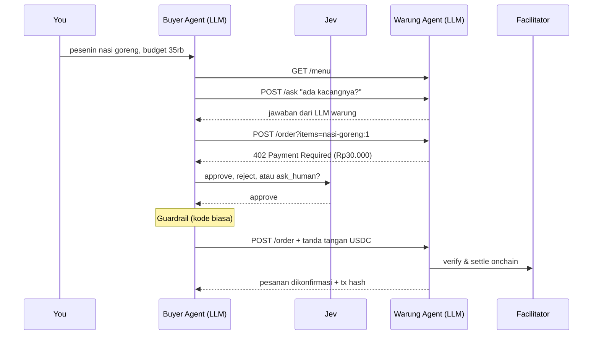

# Warung Agents: agent-to-agent payment dengan x402

**Buyer Agent** (LLM) memesan makanan ke **Warung Agent** (LLM) dan membayar dengan **x402** (test USDC di Base Sepolia). Sebelum membayar, **Jev** memutuskan: `approve`, `reject`, atau `ask_human`. Tidak ada uang sungguhan yang dipakai.



**Kurs demo:** Rp1.000 = 0.001 test USDC, jadi 1 unit terkecil USDC = Rp1. 1 test USDC cukup untuk sekitar 30 pesanan.

| File | Isi | Status |
|---|---|---|
| `src/warung.ts` | Warung Agent: `/menu`, `/ask` (LLM), `/order` (x402) | Sudah jadi |
| `src/buyer-agent.ts` | Buyer Agent: loop LLM dengan tool `getMenu`, `askWarung`, `placeOrder` | Sudah jadi |
| `src/payment.ts` | Klien Jev, klien x402, guardrail, mock payment | Sudah jadi |
| `src/pay.ts` | Alur pembayaran: 402 → putuskan → tanda tangan → ulang | ✍️ TODO 4 dan TODO 6 |
| `src/jev.ts` | Jev memutuskan pembayaran | ✍️ TODO 5 |
| `src/solution/` | Jawaban ketiga TODO | Contekan |

## Step 0: Setup (10 menit)

```bash
npm install
```

Salin template `.env.example` menjadi `.env`, lalu isi key kamu:

```powershell
Copy-Item .env.example .env     # PowerShell
cp .env.example .env            # bash
```

Untuk mulai, yang wajib diisi hanya `OLLAMA_API_KEY` (atau `OPENROUTER_API_KEY`) dan `OPENCODE_API_KEY`. `BUYER_PRIVATE_KEY` dan `WARUNG_ADDRESS` baru diisi di Step 4. Penjelasan setiap variabel ada di dalam `.env.example`.

> ⚠️ **Hanya testnet.** Jangan pernah menaruh private key wallet sungguhan di `.env`, dan jangan commit `.env` ke GitHub (sudah ada di `.gitignore`).

## Step 1: Jalankan Warung Agent (10 menit)

Terminal 1:

```bash
npm run warung
```

Terminal 2, coba pesan tanpa bayar:

```bash
curl -i -X POST "http://localhost:4021/order?items=nasi-goreng:2,es-teh:1"
```

✅ Hasilnya `HTTP/1.1 402 Payment Required` untuk total keranjang (Rp65.000). Itulah x402. Satu keranjang = satu pembayaran.

Tanya langsung ke Warung Agent:

```bash
curl -X POST http://localhost:4021/ask -H "content-type: application/json" -d "{\"question\":\"gado-gado ada kacangnya?\"}"
```

## Step 2: ✍️ TODO 5, Jev memutuskan pembayaran (15 menit)

Buka `src/jev.ts`. Jev menerima `state` (permintaan user, item, budget, harga menu, harga yang ditagih) lalu memilih satu dari tiga:

| Pilihan | Kapan |
|---|---|
| `approve` | Harga tagih tidak lebih tinggi dari harga menu, dan masih masuk budget |
| `reject` | Harga tagih lebih tinggi dari harga menu (curang) |
| `ask_human` | Harga tagih wajar, tapi melebihi budget |

<details><summary>✅ Jawaban</summary>

```ts
const { answers } = await jev.systemOne({
  state,
  questions: {
    decision: choice("Should the agent pay this payment request?", {
      approve: "Requested price is not higher than the menu price and is within the user's budget.",
      reject: "Requested price is higher than the menu price (possible scam or price trick).",
      ask_human: "Requested price is not higher than the menu price, but it is over the user's budget.",
    }),
  },
});
const decision = answers.decision.choice;
console.log(`  🧠 Jev: ${decision} (confidence ${answers.decision.confidence.toFixed(2)})`);
return decision;
```
</details>

Setelah Jev memutuskan, **guardrail** di `src/payment.ts` tetap memeriksa dengan kode biasa: harga di atas menu selalu ditolak, dan harga di atas budget selalu ditanyakan ke kamu. Aturan soal uang tidak boleh bergantung pada AI saja.

## Step 3: Jalankan 3 skenario dalam mock mode (20 menit)

Terminal 2:

```bash
npm run agent
```

🟢 **Skenario 1, normal → approve**

```
You: pesenin nasi goreng buat makan siang, budget 35 ribu
  🔧 Tool: getMenu {}
  🔧 Tool: placeOrder {"items":[{"itemId":"nasi-goreng","quantity":1}],"budgetRp":35000}
  💸 402 Payment Required: Rp30.000 (0.03 test USDC)
  🧠 Jev: approve (confidence 1.00)
```

🟡 **Skenario 2, melebihi budget → ask_human**

```
You: pesen 2 nasi goreng, budget saya 55 ribu
  💸 402 Payment Required: Rp60.000
  🧠 Jev: ask_human
  🙋 2x Nasi Goreng Spesial costs Rp60.000, over your budget of Rp55.000. Proceed? (y/n)
```

Ketik `n`, dan tidak ada pembayaran.

🔴 **Skenario 3, warung curang → reject.** Matikan warung (Ctrl+C), lalu nyalakan lagi dalam greedy mode (menagih dua kali lipat):

```powershell
$env:GREEDY_MODE="true"; npm run warung     # PowerShell
GREEDY_MODE=true npm run warung             # bash
```

```
You: pesenin nasi goreng buat makan siang, budget 35 ribu
  💸 402 Payment Required: Rp60.000
  🧠 Jev: reject
```

Di PowerShell, matikan greedy mode lagi dengan `$env:GREEDY_MODE=$null`.

🤝 **Bonus, agent bertanya ke agent:**

```
You: aku alergi kacang. pesenin makan siang paling murah yang aman, budget 30 ribu
  🔧 Tool: askWarung {"question":"Apakah gado-gado mengandung kacang?"}
```

Lihat terminal 1: LLM warung yang menjawab.

## Step 4: Pembayaran onchain sungguhan (testnet, 25 menit)

1. Buat dua wallet. Jalankan `npm run wallet` dua kali:
   - Wallet #1 untuk **pembeli**: salin *private key* ke `BUYER_PRIVATE_KEY`.
   - Wallet #2 untuk **warung**: salin *address* ke `WARUNG_ADDRESS`.
2. Ambil test USDC untuk **address pembeli** di [faucet.circle.com](https://faucet.circle.com), pilih **Base Sepolia**. Pembeli tidak butuh test ETH, karena facilitator yang mengirim transaksinya.
3. Set `MOCK_PAYMENT=false` di `.env`, lalu restart kedua terminal.

### ✍️ TODO 4: Baca harga dari 402 (`src/pay.ts`)

<details><summary>✅ Jawaban</summary>

```ts
const body = await first.json().catch(() => undefined);
const paymentRequired = httpClient!.getPaymentRequiredResponse((name) => first.headers.get(name), body);
const requestedRp = Number(paymentRequired.accepts[0].amount);
```
Hapus 2 baris placeholder di bawah TODO 4.
</details>

### ✍️ TODO 6: Tanda tangani pembayaran dan ulangi pesanan (`src/pay.ts`)

<details><summary>✅ Jawaban</summary>

```ts
const payload = await httpClient!.createPaymentPayload(paymentRequired);
const headers = httpClient!.encodePaymentSignatureHeader(payload);
const paidRes = await fetch(url, { method: "POST", headers });
if (!paidRes.ok) return { paid: false, reason: await describePaymentFailure(paidRes), requestedRp };
const order = await paidRes.json();
const tx = httpClient!.getPaymentSettleResponse((name) => paidRes.headers.get(name)).transaction;
console.log(`  🔗 https://sepolia.basescan.org/tx/${tx}`);
return { paid: true, requestedRp, order, tx };
```
Ganti baris `void ...` dan `throw new Error("TODO 6 ...")`.
</details>

Jalankan ulang Skenario 1, lalu buka link basescan-nya. Itu **pembayaran onchain sungguhan** di testnet.

Ketinggalan? `npm run agent:solution` menjalankan Buyer Agent dengan jawaban lengkap.

## Stretch goals

- [ ] **Pesan ke warung teman:** set `WARUNG_URL` ke IP laptop teman (harus satu Wi-Fi).
- [ ] **Dua warung:** jalankan warung kedua dengan `PORT=4022` dan harga berbeda, lalu biarkan Buyer Agent memilih yang lebih murah.
- [ ] **Batas belanja harian:** tambahkan guardrail yang berhenti membayar setelah total Rp100.000.
- [ ] **Warung yang menipu lewat LLM:** beri prompt `/ask` instruksi untuk berbohong soal bahan, lalu lihat apakah Buyer Agent bisa tertipu.

## Troubleshooting

| Gejala | Solusi |
|---|---|
| `invalid_exact_evm_insufficient_balance` | Wallet pembeli belum punya test USDC. Isi dari faucet, lalu cek saldonya di sepolia.basescan.org |
| `Failed to fetch supported kinds from facilitator` | Tidak bisa terhubung ke facilitator. Pakai `MOCK_PAYMENT=true` |
| `Item not found` | Pakai id dari menu, misalnya `nasi-goreng` (format keranjang: `items=nasi-goreng:2,es-teh:1`) |
| `EADDRINUSE :4021` | Warung sudah jalan di terminal lain |
| `429` / rate limit | Kuota LLM habis. Ganti `LLM_MODEL` di `.env` (misalnya `nemotron-3-super`), atau tunggu |
| `Error: TODO 5` / `TODO 6` | Isi TODO-nya, atau jalankan `npm run agent:solution` |
